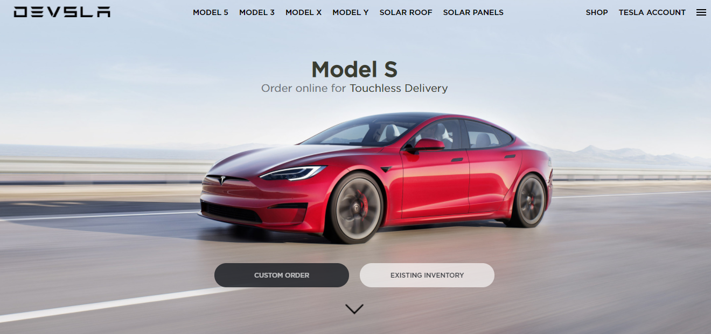

<div align="center" id="top"> 
    
</div>

<h1 align="center">Devsla</h1>

<p align="center">
  

  

  

  <a href="https://www.codacy.com/manual/Gabriel4420/devsla?utm_source=github.com&amp;utm_medium=referral&amp;utm_content=Gabriel4420/devsla&amp;utm_campaign=Badge_Grade">
    
  </a>

   <a href="https://www.linkedin.com/in/gabriel-rodrigues-perez-2069b072/">
    
  </a>
  
  
</p>


<p align="center">
  <a href="#dart-sobre">Sobre</a> &#xa0; | &#xa0; 
  <a href="#rocket-tecnologias">Tecnologias</a> &#xa0; | &#xa0;
  <a href="#white_check_mark-pré-requesitos">Pré requisitos</a> &#xa0; | &#xa0;
  <a href="#checkered_flag-começando">Começando</a> &#xa0; | &#xa0;
  <a href="https://github.com/Gabriel4420" target="_blank">Autor</a>
</p>

<br>

## :dart: Sobre ##

Interface desenvolvida no curso de HTML5 e CSS3 da B7web ministrado pelo professor Bonieky Lacerda.

## :rocket: Tecnologias ##

As seguintes ferramentas foram usadas na construção do projeto:

- [HTML5](https://alunos.b7web.com.br/curso/html5-e-css3/devsla-deixando-responsivo)
- [CSS3](https://alunos.b7web.com.br/curso/html5-e-css3/devsla-deixando-responsivo)


## :white_check_mark: Pré requisitos ##

Antes de começar :checkered_flag:, você precisa ter o [Git](https://git-scm.com).

## :checkered_flag: Começando ##

```bash
# Clone este repositório
$ git clone https://github.com/Gabriel4420/devsla

```


<h4 align="center">
  Feito com ❤️ por Gabriel Rodrigues 👋️ <a href="mailto:gabriel_rodrigues_perez@hotmail.com">Entre em contato!</a>
</h4>

&#xa0;

<p align="center">

  <a href="https://www.linkedin.com/in/gabriel-rodrigues-perez-2069b072/">
    
  </a>
  <a href="https://www.facebook.com/gabriel.rodrigues.perez">
    
  </a>
  <a href="https://www.instagram.com/gabriel_rodrigues_perez/">
    
  </a>
  
  
</p>

<a href="#top">Voltar para o topo</a>
